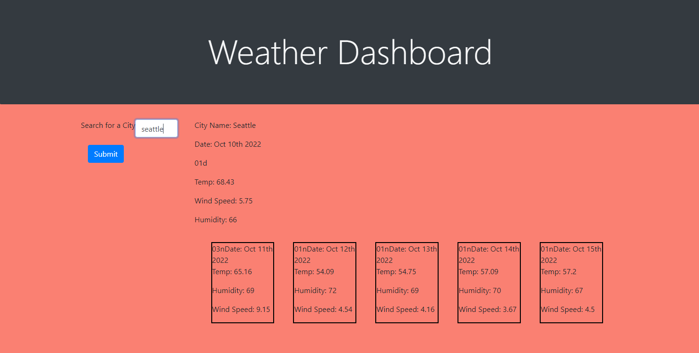

# weather-dashboard

## Description
This project was to create a a weather dashboard that showed current weather conditions in a selected city as well as a 5 day forcast. The forcast shows city name, date, temperature, wind speed, and humidity. Teh 5 day forcast shows date, temperature, humidity and wind speed. 

## Screenshots

## Link to deployed application

[Weather Dashboard](https://amassey42.github.io/weather-dashboard/)